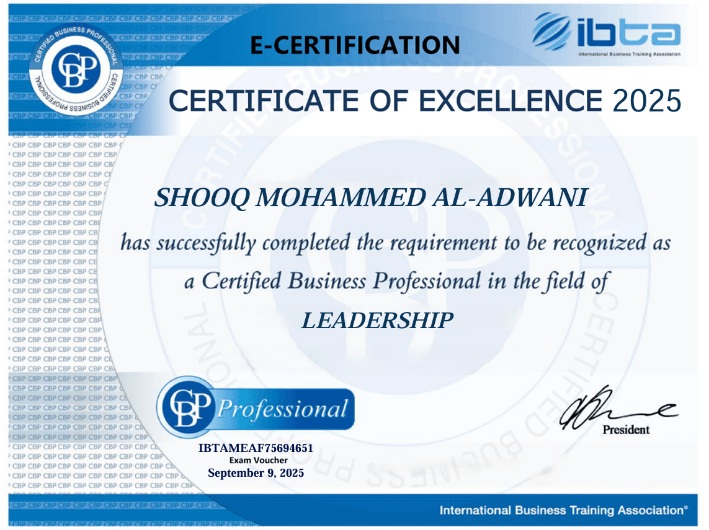
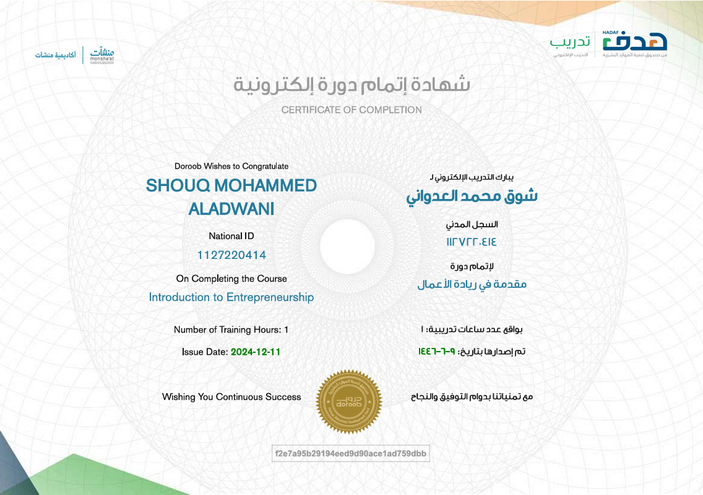

# 📜 Professional Certificates

Welcome to my professional certificates repository.

This repository contains the certificates and training courses I have completed in programming, web development, data analytics, leadership, and entrepreneurship.

---

## 📂 Repository Structure

```
Professional-Certificates/
│
├── Tuwaiq-Academy/
│   ├── HTML-Fundamentals.pdf
│   ├── CSS-Fundamentals.pdf
│   ├── JavaScript-101.pdf
│   ├── JavaScript-102.pdf
│   ├── JavaScript-103.pdf
│   ├── PHP-Basics-101.pdf
│   └── PHP-Functions-102.pdf
│
├── Data-Analytics/
│   └── PowerBI-Data-Analysis.pdf
│
├── Leadership/
│   └── Leadership-Certificate.pdf
│
└── Entrepreneurship/
    └── Introduction-to-Entrepreneurship.pdf
```

---

# 🏆 Certificates

## Tuwaiq Academy

### HTML Fundamentals


### CSS Fundamentals


### JavaScript 101


### JavaScript 102


### JavaScript 103


### PHP Basics 101


### PHP Functions 102


---

## Data Analytics

### Power BI Data Analysis


---

## Leadership

### Leadership Certificate


---

## Entrepreneurship

### Introduction to Entrepreneurship


---

## 📌 About

These certificates reflect my continuous learning journey in software development, web technologies, data analytics, leadership, and entrepreneurship.

I am committed to continuously improving my technical and professional skills through self-learning and professional training.